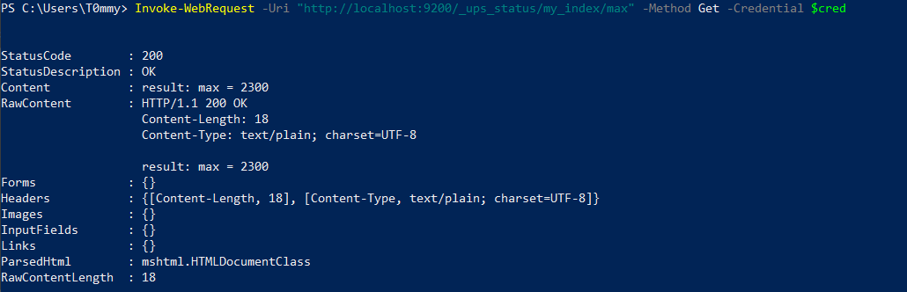
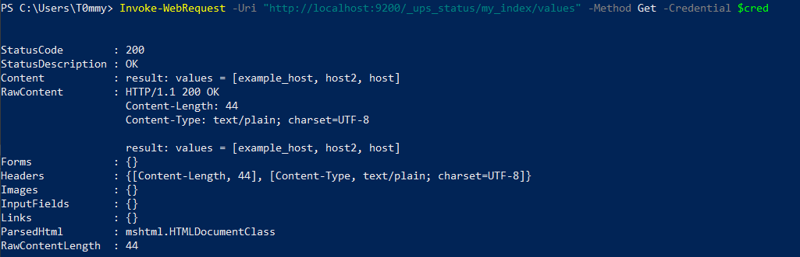
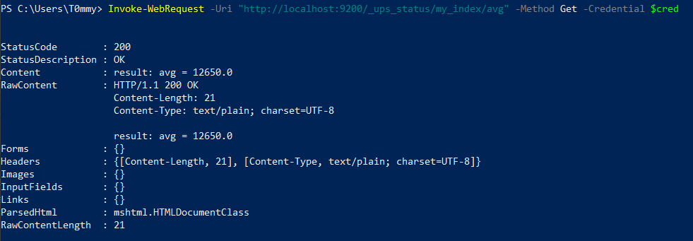

# JsonHandlerProject
## Отдельный jar файл
### Принцип работы
После компиляции программы в .jar программа запускается с помощью команды:
```bash
java -jar app_name.jar <Function Name> testData.json
```
-- ```app_name.jar``` – имя исполняемого файла;\
-- ```<Function Name>``` - название выполняемой статистической функции; \
-- ```testData.json``` – путь/имя файла с данными.

#### Формат входных данных
.json  файл должен содержать массив, состоящих данных типа

```json
 {
      "ups_adv_output_load": 6,
      "ups_adv_battery_temperature": 23,
      "@timestamp": "2021-04-20T15:34:58.290Z",
      "host": "192.168.11.9",
      "ups_adv_battery_run_time_remaining": 528000,
      "ups_adv_output_voltage": 234
 }
```

#### Ввиды поддерживаемых функцих
- `avg` - Рассчитывает среднее арифметическое в массиве данных по указанному полю (“ups_adv_battery_run_time_remaining”.).
- `max` - Вычистяет максимальное значение в массиве данных по указанному полю (“ups_adv_output_voltage”.).
- `values` - Выводит все уникальные значения в массиве данных по указанному полю (Для функции values, приложение должно использовать поле “host”.).

#### расположение jar файла
Скомпилированный jar файл располагается в директории target 

## плагин для OpenSearh

### Инструкция по примененинию
1. Скачать и развернуть OpenSearch
2. Сделать необходимые настройки
3. Перенести папку jsonhandler в /usr/share/opensearch/plugins
4. Создать новый индекс и заполнить его
5. выполнить необходимые команды


#### Создание индекса
##### Структура нового индекса: 
```json
{
  "mappings": {
    "properties": {
      "ups_adv_output_load": { "type": "integer" },
      "ups_adv_battery_temperature": { "type": "integer" },
      "@timestamp": { "type": "date" },
      "host": { "type": "keyword" },
      "ups_adv_battery_run_time_remaining": { "type": "integer" },
      "ups_adv_output_voltage": { "type": "integer" }
    }
  }
}
```
##### Пример создания индекса в powershell
```bash
$username = "admin"
$password = "admin"
$cred = New-Object System.Management.Automation.PSCredential ($username, (ConvertTo-SecureString $password -AsPlainText -Force))

Invoke-RestMethod -Uri "http://localhost:9200/my_index" -Method Put -Headers @{"Content-Type"="application/json"} -Body '{
  "mappings": {
    "properties": {
      "ups_adv_output_load": { "type": "integer" },
      "ups_adv_battery_temperature": { "type": "integer" },
      "@timestamp": { "type": "date" },
      "host": { "type": "keyword" },
      "ups_adv_battery_run_time_remaining": { "type": "integer" },
      "ups_adv_output_voltage": { "type": "integer" }
    }
  }
}' -Credential $cred
```

####  Заполнение индекса

##### Пример элемента для индекса:
```json
{
  "@timestamp": "2024-03-06T15:17:35",
  "host": "host2",
  "ups_adv_battery_run_time_remaining": 36000,
  "ups_adv_battery_temperature": 25,
  "ups_adv_output_load": 50,
  "ups_adv_output_voltage": 2300
}
```
##### Пример добавление нового элемента в индекс используя powershell
```
Invoke-RestMethod -Uri "http://localhost:9200/my_index/_doc" -Method Post -Headers @{"Content-Type"="application/json"} -Body '{
  "@timestamp": "2024-03-06T15:17:35",
  "host": "host2",
  "ups_adv_battery_run_time_remaining": 36000,
  "ups_adv_battery_temperature": 25,
  "ups_adv_output_load": 50,
  "ups_adv_output_voltage": 2300
}' -Credential $cred
```

#### Выполнение команды 
#### Структура запроса
Чтобы осуществить работу плагина, необходимо выполнить GET запрос по адресу:
```
{opensearch_address}/_ups_status/{index_name}/{function}
```
, где
- ```opensearch_address``` - адрес, на котором работает opensearch
- ```index_name```  - название индекса
- ```function``` - название функции которая будет выполняться

Функции:
- `avg` - Рассчитывает среднее арифметическое в массиве данных по указанному полю (“ups_adv_battery_run_time_remaining”.).
- `max` - Вычистяет максимальное значение в массиве данных по указанному полю (“ups_adv_output_voltage”.).
- `values` - Выводит все уникальные значения в массиве данных по указанному полю (Для функции values, приложение должно использовать поле “host”.)

##### Примеры запросов:
- max\
```Invoke-WebRequest -Uri "http://localhost:9200/_ups_status/my_index/max" -Method Get -Credential $cred```
- avg\
```Invoke-WebRequest -Uri "http://localhost:9200/_ups_status/my_index/values" -Method Get -Credential $cred```
- values\
```Invoke-WebRequest -Uri "http://localhost:9200/_ups_status/my_index/avg" -Method Get -Credential $cred```

##### Примеры ответов
- Операцмя max

- Операция values

- Операция values



### Расположение плагина
Папка с плагином расположена в папке plugins
Помимо самого jar файла, плагин содержит [plugin-descriptor.properties](plugin/json-handler/plugin-descriptor.properties)